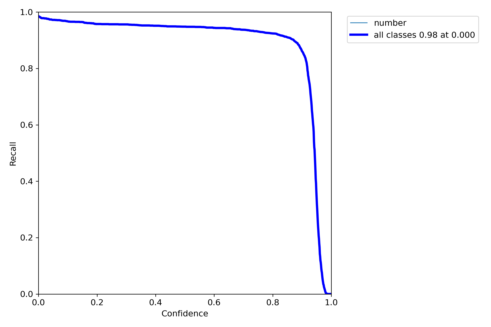

# CarNumberDetection

This project is experiment with yolo dists for detecting car numbers.

### Requirements

- Python >= 3.8
- RAM >= 16GB
- GPU >= 8GB
- CUDA >= 11.0

### Used technologies

- YoloV5
- YoloV7
- Tessaract
- DVC

## Quick start

### Environment setup

Make executable file for environment setup:

```bash
chmod +x env_setup.sh
```

Run environment setup:

```bash
./env_setup.sh
```

### Usage with DVC

Run the following command to start the project:

```bash
dvc repro
```

## License

BiFolio is licensed under the MIT License. See [LICENSE](LICENSE) for the full license text.

# Learning process screenshot


## DVC Dag


# Experiments

# YOLOv5

<details>

## Images

### yolov5m_Adam_40
#### F1_curve

<details>


</details>

#### PR_curve

<details>


</details>

#### P_curve

<details>


</details>

#### R_curve

<details>


</details>

#### confusion_matrix

<details>


</details>

#### labels

<details>


</details>

#### labels_correlogram

<details>


</details>

#### results

<details>


</details>

#### train_batch0

<details>


</details>

#### train_batch1

<details>


</details>

#### train_batch2

<details>


</details>

#### val_batch0_labels

<details>


</details>

#### val_batch0_pred

<details>


</details>

#### val_batch1_labels

<details>


</details>

#### val_batch1_pred

<details>


</details>

#### val_batch2_labels

<details>


</details>

#### val_batch2_pred

<details>


</details>

### yolov5m_SGD_20
#### F1_curve

<details>


</details>

#### PR_curve

<details>


</details>

#### P_curve

<details>


</details>

#### R_curve

<details>


</details>

#### confusion_matrix

<details>


</details>

#### labels

<details>


</details>

#### labels_correlogram

<details>


</details>

#### results

<details>


</details>

#### train_batch0

<details>


</details>

#### train_batch1

<details>


</details>

#### train_batch2

<details>


</details>

#### val_batch0_labels

<details>


</details>

#### val_batch0_pred

<details>


</details>

#### val_batch1_labels

<details>


</details>

#### val_batch1_pred

<details>


</details>

#### val_batch2_labels

<details>


</details>

#### val_batch2_pred

<details>


</details>

### yolov5m_SGD_30
#### F1_curve

<details>


</details>

#### PR_curve

<details>


</details>

#### P_curve

<details>


</details>

#### R_curve

<details>


</details>

#### confusion_matrix

<details>


</details>

#### labels

<details>


</details>

#### labels_correlogram

<details>


</details>

#### results

<details>


</details>

#### train_batch0

<details>


</details>

#### train_batch1

<details>


</details>

#### train_batch2

<details>


</details>

#### val_batch0_labels

<details>


</details>

#### val_batch0_pred

<details>


</details>

#### val_batch1_labels

<details>


</details>

#### val_batch1_pred

<details>


</details>

#### val_batch2_labels

<details>


</details>

#### val_batch2_pred

<details>


</details>

### yolov5m_SGD_40
#### F1_curve

<details>


</details>

#### PR_curve

<details>


</details>

#### P_curve

<details>


</details>

#### R_curve

<details>


</details>

#### confusion_matrix

<details>


</details>

#### labels

<details>


</details>

#### labels_correlogram

<details>


</details>

#### results

<details>


</details>

#### train_batch0

<details>


</details>

#### train_batch1

<details>


</details>

#### train_batch2

<details>


</details>

#### val_batch0_labels

<details>


</details>

#### val_batch0_pred

<details>


</details>

#### val_batch1_labels

<details>


</details>

#### val_batch1_pred

<details>


</details>

#### val_batch2_labels

<details>


</details>

#### val_batch2_pred

<details>


</details>

### yolov5n_AdamW_20
#### F1_curve

<details>


</details>

#### PR_curve

<details>


</details>

#### P_curve

<details>


</details>

#### R_curve

<details>


</details>

#### confusion_matrix

<details>


</details>

#### labels

<details>


</details>

#### labels_correlogram

<details>


</details>

#### results

<details>


</details>

#### train_batch0

<details>


</details>

#### train_batch1

<details>


</details>

#### train_batch2

<details>


</details>

#### val_batch0_labels

<details>


</details>

#### val_batch0_pred

<details>


</details>

#### val_batch1_labels

<details>


</details>

#### val_batch1_pred

<details>


</details>

#### val_batch2_labels

<details>


</details>

#### val_batch2_pred

<details>


</details>

### yolov5n_AdamW_30
#### F1_curve

<details>


</details>

#### PR_curve

<details>


</details>

#### P_curve

<details>


</details>

#### R_curve

<details>


</details>

#### confusion_matrix

<details>


</details>

#### labels

<details>


</details>

#### labels_correlogram

<details>


</details>

#### results

<details>


</details>

#### train_batch0

<details>


</details>

#### train_batch1

<details>


</details>

#### train_batch2

<details>


</details>

#### val_batch0_labels

<details>


</details>

#### val_batch0_pred

<details>


</details>

#### val_batch1_labels

<details>


</details>

#### val_batch1_pred

<details>


</details>

#### val_batch2_labels

<details>


</details>

#### val_batch2_pred

<details>


</details>

### yolov5n_AdamW_40
#### F1_curve

<details>


</details>

#### PR_curve

<details>


</details>

#### P_curve

<details>


</details>

#### R_curve

<details>


</details>

#### confusion_matrix

<details>


</details>

#### labels

<details>


</details>

#### labels_correlogram

<details>


</details>

#### results

<details>


</details>

#### train_batch0

<details>


</details>

#### train_batch1

<details>


</details>

#### train_batch2

<details>


</details>

#### val_batch0_labels

<details>


</details>

#### val_batch0_pred

<details>


</details>

#### val_batch1_labels

<details>


</details>

#### val_batch1_pred

<details>


</details>

#### val_batch2_labels

<details>


</details>

#### val_batch2_pred

<details>


</details>

### yolov5n_Adam_20
#### F1_curve

<details>


</details>

#### PR_curve

<details>


</details>

#### P_curve

<details>


</details>

#### R_curve

<details>


</details>

#### confusion_matrix

<details>


</details>

#### labels

<details>


</details>

#### labels_correlogram

<details>


</details>

#### results

<details>


</details>

#### train_batch0

<details>


</details>

#### train_batch1

<details>


</details>

#### train_batch2

<details>


</details>

#### val_batch0_labels

<details>


</details>

#### val_batch0_pred

<details>


</details>

#### val_batch1_labels

<details>


</details>

#### val_batch1_pred

<details>


</details>

#### val_batch2_labels

<details>


</details>

#### val_batch2_pred

<details>


</details>

### yolov5n_Adam_30
#### F1_curve

<details>


</details>

#### PR_curve

<details>


</details>

#### P_curve

<details>


</details>

#### R_curve

<details>


</details>

#### confusion_matrix

<details>


</details>

#### labels

<details>


</details>

#### labels_correlogram

<details>


</details>

#### results

<details>


</details>

#### train_batch0

<details>


</details>

#### train_batch1

<details>


</details>

#### train_batch2

<details>


</details>

#### val_batch0_labels

<details>


</details>

#### val_batch0_pred

<details>


</details>

#### val_batch1_labels

<details>


</details>

#### val_batch1_pred

<details>


</details>

#### val_batch2_labels

<details>


</details>

#### val_batch2_pred

<details>


</details>

### yolov5n_Adam_40
#### F1_curve

<details>


</details>

#### PR_curve

<details>


</details>

#### P_curve

<details>


</details>

#### R_curve

<details>


</details>

#### confusion_matrix

<details>


</details>

#### labels

<details>


</details>

#### labels_correlogram

<details>


</details>

#### results

<details>


</details>

#### train_batch0

<details>


</details>

#### train_batch1

<details>


</details>

#### train_batch2

<details>


</details>

#### val_batch0_labels

<details>


</details>

#### val_batch0_pred

<details>


</details>

#### val_batch1_labels

<details>


</details>

#### val_batch1_pred

<details>


</details>

#### val_batch2_labels

<details>


</details>

#### val_batch2_pred

<details>


</details>

### yolov5n_SGD_20
#### F1_curve

<details>


</details>

#### PR_curve

<details>


</details>

#### P_curve

<details>


</details>

#### R_curve

<details>


</details>

#### confusion_matrix

<details>


</details>

#### labels

<details>


</details>

#### labels_correlogram

<details>


</details>

#### results

<details>


</details>

#### train_batch0

<details>


</details>

#### train_batch1

<details>


</details>

#### train_batch2

<details>


</details>

#### val_batch0_labels

<details>


</details>

#### val_batch0_pred

<details>


</details>

#### val_batch1_labels

<details>


</details>

#### val_batch1_pred

<details>


</details>

#### val_batch2_labels

<details>


</details>

#### val_batch2_pred

<details>


</details>

### yolov5n_SGD_30
#### F1_curve

<details>


</details>

#### PR_curve

<details>


</details>

#### P_curve

<details>


</details>

#### R_curve

<details>


</details>

#### confusion_matrix

<details>


</details>

#### labels

<details>


</details>

#### labels_correlogram

<details>


</details>

#### results

<details>


</details>

#### train_batch0

<details>


</details>

#### train_batch1

<details>


</details>

#### train_batch2

<details>


</details>

#### val_batch0_labels

<details>


</details>

#### val_batch0_pred

<details>


</details>

#### val_batch1_labels

<details>


</details>

#### val_batch1_pred

<details>


</details>

#### val_batch2_labels

<details>


</details>

#### val_batch2_pred

<details>


</details>

### yolov5n_SGD_40
#### F1_curve

<details>


</details>

#### PR_curve

<details>


</details>

#### P_curve

<details>


</details>

#### R_curve

<details>


</details>

#### confusion_matrix

<details>


</details>

#### labels

<details>


</details>

#### labels_correlogram

<details>


</details>

#### results

<details>


</details>

#### train_batch0

<details>


</details>

#### train_batch1

<details>


</details>

#### train_batch2

<details>


</details>

#### val_batch0_labels

<details>


</details>

#### val_batch0_pred

<details>


</details>

#### val_batch1_labels

<details>


</details>

#### val_batch1_pred

<details>


</details>

#### val_batch2_labels

<details>


</details>

#### val_batch2_pred

<details>


</details>

</details>

# YOLOv7

<details>

### yolov7_std
#### F1_curve

<details>


</details>

#### PR_curve

<details>


</details>

#### P_curve

<details>


</details>

#### R_curve

<details>


</details>

#### confusion_matrix

<details>


</details>

### yolov7_lr001
#### F1_curve

<details>


</details>

#### PR_curve

<details>


</details>

#### P_curve

<details>


</details>

#### R_curve

<details>


</details>

#### confusion_matrix

<details>


</details>

</details>
